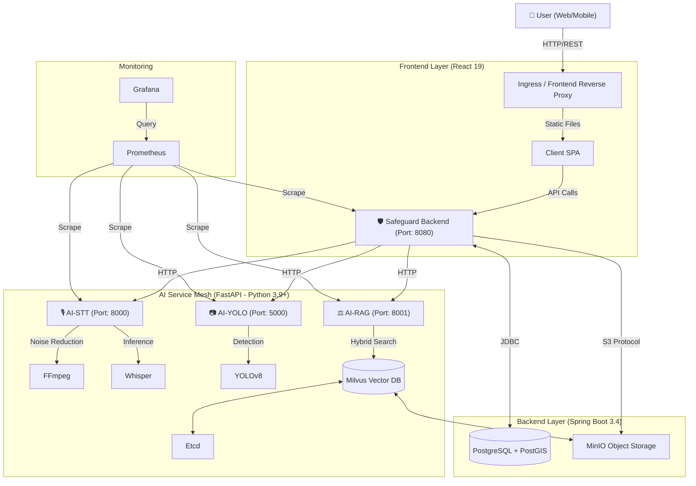

# 🏛 Project SafeGuard: AI 기반 차세대 민원 통합 관리 플랫폼
> **"시민의 목소리를 정확하게, 공무원의 업무를 효율적으로"**
> 최신 AI 기술(LLM-RAG, Speech-to-Text, Computer Vision)이 적용된 지능형 민원 자동 분류 및 통합 처리 시스템

---

## 0️⃣ 문서 개요 (Document Overview)
본 문서는 **SafeGuard** 프로젝트의 시스템 아키텍처, 기술 스택, 핵심 알고리즘 및 데이터 흐름을 코어 수준에서 상세히 기술한 **시스템 백서(System Whitepaper)**입니다. 현재 구축된 코드베이스(`v1.0`)를 기준으로 작성되었습니다.

- **대상 독자**: 시스템 아키텍트, 백엔드/AI 엔지니어, 프로젝트 이해관계자
- **문서 버전**: v2.0 (Codebase Synchronization Complete)
- **최종 수정일**: 2026-01-17

---

## 1️⃣ 핵심 가치 및 목표 (Executive Summary)

### 1.1 해결하고자 하는 문제 (Pain Points)
1.  **민원 접수의 불편함**: 복잡한 카테고리 선택과 긴 텍스트 입력 과정.
2.  **분류의 비효율성**: 담당 공무원이 수동으로 내용을 읽고 부서를 지정해야 함(분류 지연).
3.  **개인정보 유출 위험**: 민원 첨부 사진에 타인의 얼굴이나 차량 번호판이 노출됨.
4.  **불명확한 처리 기준**: 담당자의 주관에 따라 부서가 오배정되는 사례 빈번.

### 1.2 솔루션 (Solution)
- **음성/사진 기반 간편 접수**: STT와 객체 탐지 기술로 입력 장벽 제거.
- **AI 자동 분류 (Hybrid RAG)**: 법령 데이터 기반의 자동 부서 매칭 및 근거 제시.
- **개인정보 자동 마스킹**: 이미지 업로드 즉시 민감 정보(번호판, 얼굴) 비식별화.
- **실시간 관제 대시보드**: 30초 단위 자동 갱신되는 관리자 현황판 제공.

---

## 2️⃣ 시스템 아키텍처 (System Architecture)

본 시스템은 **Docker Compose** 기반의 **On-Premises Microservices Architecture**로 설계되었습니다. 모든 서비스는 `safeguard-network` 내부 브리지 네트워크를 통해 격리된 통신을 수행합니다.

### 2.1 아키텍처 다이어그램 (Logical View)



### 2.2 인프라 및 네트워크 구성 (Infrastructure)
| 서비스명 | 컨테이너 명 (`container_name`) | 포트 (Host:Container) | 역할 및 설명 |
| :--- | :--- | :--- | :--- |
| **Frontend** | `safeguard-frontend` | **80**:80 | React SPA 호스팅 (Nginx). `ai-yolo`, `backend` 의존성 보유. |
| **Backend** | `safeguard-backend` | **8080**:8080 | 핵심 비즈니스 로직, 인증, 데이터 관리. |
| **Database** | `safeguard-db` | **5433**:5432 | PostgreSQL 16 + PostGIS. 민원 및 위치 데이터 저장. |
| **AI-STT** | `safeguard-ai-stt` | **8000**:8000 | 음성 -> 텍스트 변환 및 전처리 엔진. |
| **AI-RAG** | `safeguard-ai-rag` | **8001**:8001 | 민원 분류 및 법령 하이브리드 검색 엔진. |
| **AI-YOLO** | `safeguard-ai-yolo` | **5001**:5000 | 이미지 개인정보(번호판, 얼굴) 마스킹 처리. |
| **Milvus** | `milvus-standalone` | **19530**:19530 | 벡터 데이터베이스 (Standalone Mode). |
| **MinIO** | `milvus-minio` | **9001**:9001 | 객체 스토리지 (S3 호환). 이미지/오디오/벡터파일 저장. |

---

## 3️⃣ 상세 기술 스택 (Detailed Technology Stack)

### 3.1 Frontend (User Interface)
- **Core**: React 19, Vite 5.x, TypeScript
- **Style**: **TailAdmin Template** 기반 (Tailwind CSS v4.1.18 - Dev)
- **Map**: **Kakao Map API** (Clusterer, Polygon Hotspot Visualization)
- **Charts**: ApexCharts, React-ApexCharts (실시간 대시보드 시각화)
- **Icons**: Lucide React
- **Features**: 30초 자동 갱신 대시보드, SLA 카운트다운, 모바일 반응형 UI.

### 3.2 Backend (Core System)
- **Framework**: Spring Boot 3.4.1 (Java 17)
- **Database**: PostgreSQL 16 (w/ PostGIS Extension)
- **ORM Strategy (Hybrid)**:
    - **JPA (Hibernate Spatial)**: 도메인 엔티티 관리, CRUD, 위치 데이터 처리 (Point, Polygon).
    - **MyBatis 3.0.4**: 복잡한 통계 쿼리, 대시보드 데이터 집계 최적화.
- **Security**: Spring Security + JWT (Stateless Authentication).
- **Storage**: AWS S3 SDK (MinIO 연동).

### 3.3 AI Layer (Intelligent Services)
모든 AI 서비스는 **FastAPI**를 기반으로 마이크로서비스로 구축되었으며, **Prometheus Audit Log**를 미들웨어로 탑재하고 있습니다.

#### A. STT (Speech-to-Text) Service
- **Model**: OpenAI Whisper (`base` model)
- **Pipeline**:
    1.  **FFmpeg `afftdn` Filter**: 배경 소음(바람소리 등) 실시간 주파수 제거.
    2.  **FFmpeg Normalize**: 16kHz 리샘플링 및 볼륨 평탄화.
    3.  **Whisper Inference**: GPU/CPU 가속 추론.
    4.  **Anti-Hallucination Filter**: 침묵 구간 반복 생성 억제, 단문/특수문자 필터링.

#### B. RAG (Retrieval-Augmented Generation) Service
- **Vector DB**: Milvus 2.3
- **Classification Engine**: `classification_service.py`
- **Search Strategy**: **Hybrid RAG (implemented in `query.py`)**
    - **Semantic Search**: `sentence-transformers` -> 의미 기반 검색.
    - **Keyword Search**: `Rank-BM25` + `Kiwipiepy` -> 정확한 용어 매칭.
    - **RRF (Reciprocal Rank Fusion)**: `Score = 1 / (k + rank + 1)` 공식을 사용하여 두 검색 결과의 순위를 공정하게 융합.
- **Data**: 대한민국 주요 법령 PDF (도로교통법, 건축법 등).

#### C. YOLO (Visual Classification) Service
- **Model**: YOLOv8 (Ultralytics) Custom Fine-tuned (`infer_image_complaint.pt`)
- **Action**: 민원 이미지 업로드 시 객체 탐지 및 자동 분류.
- **Target**: 불법주정차, 쓰레기, 현수막, 보행방해물 등 5대 민원 탐지.
- **Output**: 탐지된 객체 유형에 따라 담당 기관(Agency) 자동 매핑 (예: 불법주정차 -> 경찰청).

---

## 4️⃣ 데이터 처리 흐름 (End-to-End Data Flow)

### 4.1 민원 접수 및 처리 프로세스
1.  **사용자 입력**: 웹 브라우저에서 음성 녹음 또는 텍스트 입력, 사진 업로드.
2.  **프론트엔드 처리**:
    - `MediaRecorder API`로 오디오 Blob 생성.
    - `Web Speech API`로 실시간 자막 미리보기 제공.
3.  **백엔드 수신 및 오케스트레이션**:
    - `Multipart/form-data`로 오디오/이미지 수신.
4.  **병렬 AI 처리**:
    - **(Async) 이미지 처리**: `AI-YOLO` 서버로 전송 → 마스킹된 이미지 S3(MinIO) 저장.
    - **(Sync) 음성 분석**: `AI-STT` 서버로 전송 → 텍스트 변환 결과 수신.
    - **(Sync) 분류/추천**: 변환된 텍스트를 `AI-RAG` 서버로 전송 → 담당 기관(Agency) 및 법령 근거 수신.
5.  **저장 및 응답**:
    - 변환된 텍스트, 마스킹된 이미지 경로, 추천된 기관 정보를 DB에 저장(`Insert`).
    - 사용자에게 접수 완료 메시지 및 예상 민원 분류 결과 즉시 반환.

---

## 5️⃣ 상세 시스템 로직 (Deep Dive Logic)

### 5.1 STT 환각/소음 제어 로직
단순히 모델만 돌리는 것이 아니라, 실제 운영 환경의 잡음을 고려한 전처리 파이프라인이 핵심입니다.
- **Noise Reduction**: `ffmpeg -af afftdn` 필터를 사용하여 FFT(고속 푸리에 변환) 기반으로 지속적인 배경 소음을 제거합니다.
- **Whisper Option**: `condition_on_previous_text=False` 설정을 통해 이전 문맥에 의존하여 없는 말을 지어내는 Hallucination 현상을 억제합니다.
- **Post-Processing**: `UnifiedComplaintManager._filter_hallucination` 함수에서 5글자 미만의 무의미한 결과나 특수문자 반복을 `ValueError` 처리하여 DB 오염을 방지합니다.

### 5.2 RAG 분류 결정 로직 (Hierarchical Decision)
단순 검색 결과(Retrieval)를 넘어, **행정 도메인 특화 룰(Rule)**을 결합하여 최종 분류를 결정합니다.

#### Step 1: Hybrid Retrieval (query.py)
- **Vector Search** (의미) + **BM25** (키워드) 실행.
- **RRF (Reciprocal Rank Fusion)** 알고리즘으로 상위 법령 5개 추출 및 재정렬.

#### Step 2: Decision Making (classification_service.py)
- **Keyword Bonus**: 사용자 질문에 '주차', '소음' 등 강력한 도메인 힌트가 있으면 해당 기관 점수 부스팅 (+1.0 ~ +3.0).
- **Broad Law Penalty**: '민원 처리에 관한 법률', '행정절차법' 등 범용 법령은 가중치를 대폭 낮춤(0.35x).
- **MOIS Guard (행안부 방어)**: '재난', '등본' 등 특정 문맥이 없으면 행안부 점수를 강제로 제한(Cap)하여 쏠림 방지.
- **Thresholding**: 1순위와 2순위의 점수 차이가 미미하거나(`Gap < 0.4`), 전체 신뢰도가 낮으면(`Confidence < 0.45`) '기타'로 분류.

### 5.3 지리정보 시각화 (GIS & Map)
- **Kakao Map API**: `MapView.tsx`에서 클러스터링(`MarkerClusterer`)을 통해 대량의 마커를 효율적으로 렌더링.
- **Hotspot Visualization**: 단순 마커 뷰 외에, 민원 밀집 지역을 색상 스펙트럼(Blue -> Red)으로 표현하는 '핫스팟 모드' 제공 (Polygon Rendering).

### 5.4 대시보드 리얼타임 아키텍처
- **Polling vs Socket**: 현재는 안정성을 위해 **Short Polling** 방식을 최적화하여 사용.
- **30s Timer**: 프론트엔드(`Dashboard.tsx`) 내에서 `setInterval` 타이머가 동작하며, 0초 도달 시 `refreshKey` State를 변경.
- **Refresh Flow**: `refreshKey`가 변경되면 하위 모든 차트 컴포넌트(`ComplaintTrendChart` 등)가 `useEffect`를 트리거하여 백엔드의 `/api/complaints/stats` API를 병렬 호출. 사용자 개입 없이 항상 최신 1분 내의 데이터를 유지함.

---

## 6️⃣ API 인터페이스 (Internal API Specs)

### 6.1 AI-STT (`:8000`)
- `POST /upload_voice`: 오디오 파일 업로드 → 텍스트 반환.
- `POST /process_voice`: 텍스트 직접 입력 시 분석 수행.

### 6.2 AI-RAG (`:8001`)
- `POST /classify`: 텍스트 → 기관(Agency), 카테고리, 법령 근거 반환.
- `POST /generate-title`: 텍스트 + 주소 → **NLP 키워드 추출(Kiwi)** 기반의 제목 자동 생성.

### 6.3 AI-YOLO (`:5000`)
- `POST /api/analyze-image`: 이미지 업로드 → 마스킹된 이미지 반환.

### 6.4 Backend Main (`:8080`)
- `GET /api/complaints/stats/dashboard`: 대시보드용 KPI 및 통계 데이터 집계 (MyBatis).
- `POST /api/complaints`: 민원 접수 및 파이프라인 실행.
- `GET /api/complaints/map`: 지도 마커용 경량 데이터 리스트 반환.

---

## 7️⃣ 운영 및 유지보수

### 7.1 모니터링 (Observability)
- 각 AI 서비스는 `prometheus-client`를 통해 `/metrics` 엔드포인트를 노출하고 있습니다.
- 수집 지표: `http_requests_total` (요청 수), `http_request_duration_seconds` (응답 속도).

### 7.2 배포 (Deploy)
```bash
# 전체 시스템 빌드 및 실행 (Detached Mode)
docker-compose up -d --build
```
- 초기 데이터 적재: PostGIS, Milvus 초기화 스크립트 자동 실행.
- 재시작 정책: `restart: unless-stopped` (서버 재부팅 시 자동 복구).

---

## 8️⃣ 한계 및 기술 부채 (Limitations & Tech Debt)
- **JWT Secret**: 현재 설정 파일 내 하드코딩 되어있어, 운영 배포 시 환경 변수(`System.getenv`) 처리로 리팩토링 필요.
- **트래픽 확장성**: 단일 Docker Host 구성으로, 트래픽 급증 시 Kubernetes(K8s) 등의 오케스트레이션 도구 도입 고려 필요.

---
**[End of Document]**
